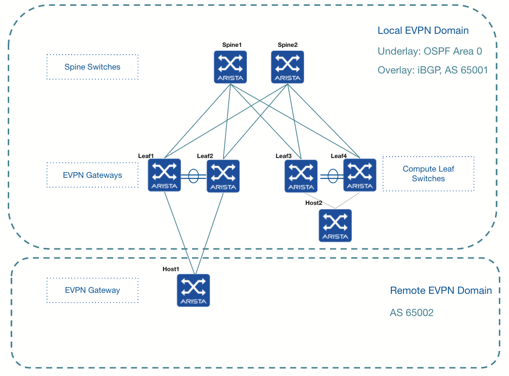

# LAB: L2 EVPN Gateway

## About

Goal of this lab: Understand L2 EVPN Gateways



## Before you start the Labs


```cli
! Save the base configuration of all devices including Host1 and Host2
write

! Copy the startup config to another file
copy flash:startup-config flash:pre_lab0_config

```

## Configure Leaf1 and Leaf2 as L2 EVPN Gateways

Configure Leaf1 and Leaf2 as L2 EVPN Gateways

The existing Leaf/Spine Architecture is the EVPN local domain

Host1 will simulate the remote EVPN domain which is composed of one Leaf only in this lab

Configure different RDs and RTs for the remote domain


## Configure Host1 as a Leaf Switch part of the remote domain

__1. Configure eBGP as Underlay__

Configure eBGP as an underlay between
- Leaf1 and Leaf2: on Ethernet interfaces 5
- and Host1: on Ethernet interfaces 3 and 4

Remove the port-channel 2 as it is not needed anymore

Use BGP AS 65002 for Host 1


__2. Configure eBGP as Overlay__

Configure eBGP as an overlay between Leaf1 and Leaf2 and Host1


__3. Extend the existing VLANs to the remote domain__

Configure the MAC VRFs on Host1

Configure the VLAN to VNI mapping on Host1


## Check MAC address tables, VLANs, EVPN routes and VXLAN outputs

Generate traffic from host2 by ping the broadcast address in VLAN 112 t be able to interesting outputs

```cli

show bgp evpn

show bgp evpn summary

show bgp evpn route-type imet vni 10

show bgp evpn route-type mac-ip

show bgp evpn route-type imet

show bgp evpn route-type mac-ip detail

```